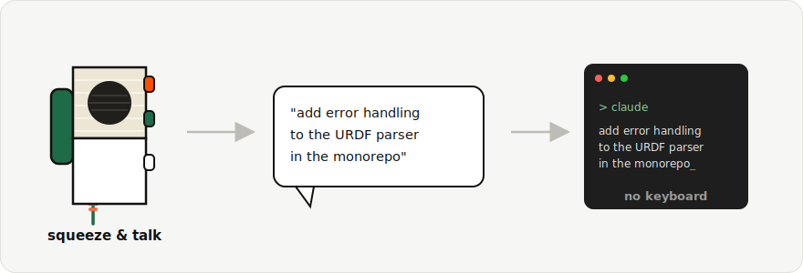
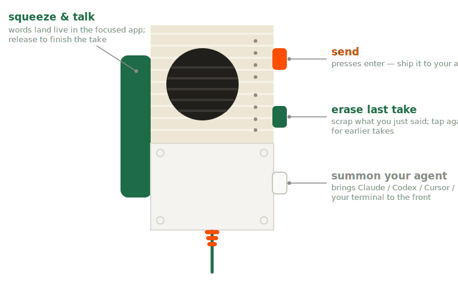

# tingle

**Voice-first agentic coding with a [Teenage Engineering EP-2350 "ting"](https://teenage.engineering/store/ep-2350).**

<p align="center"></p>

Squeeze the ting's trigger and talk — your words appear live in whatever app
is focused (Claude Code, Codex, anything). Release to finish, tap orange to
send, tap green to scrap the take, tap white to summon your agent to the
front. It's a physical push-to-talk button for coding with agents: pick up
the mic, say what you want, put it down.

Under the hood, a tiny MicroPython event engine installs onto the ting's own
disk in one click (no firmware modification, fully reversible). Button
presses reach your Mac instantly over USB, or — when the ting is untethered
on batteries — over an inaudible ultrasonic chirp protocol on the audio
cable. You never think about any of that; you just squeeze and talk.

## Requirements

macOS only. Live **dictation requires macOS 26 (Tahoe) or later** — it uses
Apple's on-device `SpeechAnalyzer`. Everything else (button macros,
keystrokes, shell actions) works on macOS 13+. Apple Silicon or Intel. You
also need the hardware below.

## Hardware setup

You need:

1. **A Teenage Engineering EP-2350 "ting"** — the lo-fi FX microphone.
2. **A USB line-in adapter.** The ting's curly cable outputs *line-level*
   audio, and Mac headphone jacks don't accept line-in — plugging the ting
   straight into your laptop's 3.5mm port will not work. Any USB audio
   interface with a line input is fine; a cheap one that works well is the
   [Cubilux USB-C line-in adapter](https://www.amazon.com/dp/B0CNCL21RR)
   (line-in + mic-in + headphone-out on one USB-C plug).
3. Optionally, **a USB-C cable** to the ting for docked use (instant button
   events, battery readout) and for the one-time flash.

Wiring: ting line-out → adapter **line-in** port → Mac USB. Turn the green
volume knob under the ting's lid up to around halfway.

## Getting started

### Install with Homebrew (recommended)

```sh
brew install --cask tutorintelligence/tap/tingle
```

tingle isn't code-signed yet (Apple Developer enrollment in progress).
macOS tags downloaded apps with a quarantine flag so Gatekeeper can vet
them on first launch — and unsigned apps fail that check with "Apple
could not verify tingle is free of malware". The cask therefore removes
the quarantine flag after install. If you'd rather keep Gatekeeper in
the loop, build from source below instead, then approve the app under
System Settings → Privacy & Security → "Open Anyway". Once signing
lands, none of this applies.

### Install from source

You need Xcode Command Line Tools (`xcode-select --install`) and macOS 26+
for dictation.

```sh
git clone https://github.com/tutorintelligence/tingle.git
cd tingle
swift build -c release
./scripts/bundle.sh
cp -r dist/tingle.app /Applications/
open /Applications/tingle.app
```

**Or just paste this to Claude Code / Codex and let it do everything:**

> Install tingle with `brew install --cask tutorintelligence/tap/tingle`
> and launch it. Then tell me what the menu bar shows and walk me through
> flashing my ting and granting the microphone and accessibility
> permissions.

### First run

1. Launch tingle — a striped-circle icon appears in the menu bar.
2. Plug the ting in over USB-C and choose **Flash EP…** from the menu. This
   writes four inaudible signal tones and the event engine onto the ting's
   disk (existing contents are backed up first). Power-cycle the ting when
   prompted: press the small button above its USB-C port, then push the
   handle to start it.
3. Grant the two permission prompts (microphone, accessibility) — tingle
   asks at launch, and the menu bar icon wears an orange "!" badge with
   fix-it menu items until both are granted.
4. Squeeze the trigger and talk. Words appear where your cursor is.

The menu bar dot tells you everything: green = ting present (USB, or heard
by its ultrasonic heartbeat), orange = searching, red = trigger held /
dictating, none = no ting around. Input-device selection is automatic —
tingle finds whichever line-in the ting is plugged into by listening for
its heartbeat.

## Default controls

<p align="center"></p>

| Input | Action |
|---|---|
| squeeze handle | dictate live into the focused app; release to finish |
| orange button | enter (send it) |
| green button | erase the last dictated take (repeat for earlier takes) |
| white button | summon your agent — brings the first running AI coding app (Claude, Codex, Cursor, iTerm2, Terminal) to the front |

Every one of these is just a default. tingle is configurable by design: the
whole control scheme lives in the TOML file below, and any behavior — the
summon list, what green erases, what orange sends, the dictation vocabulary —
is yours to change.

## Configuration

Everything lives in one literate TOML file —
`~/Library/Application Support/tingle/config.toml` ("Edit config…" in the
menu) — which documents itself and live-reloads on save:

```toml
vocabulary = ["Claude", "Codex", "kubectl"]   # bias recognition toward your jargon

[replacements]                                # fix what biasing can't
"Tamil" = "TOML"

[mappings]
triggerDown = { type = "dictate" }
fxChange    = { type = "keystroke", key = "return" }
modeChange  = { type = "eraseDictation" }
mode1       = { type = "shell", command = """
open -a "Claude"                              # multiline scripts welcome
""" }
```

Actions: `dictate`, `eraseDictation`, `keystroke`, `keyHold` (held until you
release the trigger), and `shell`. The white button gives you four mappable
slots (`mode1`–`mode4`), selected by the ting's green mode LED.

Dictation uses Apple's on-device speech stack (macOS 26+). Everything else
works on macOS 13+.

## How it works

The ting executes user Python from its USB disk at boot. tingle ships an
event engine that chains the stock firmware behavior, then reports button
and trigger events as serial lines (docked) and as ultrasonic codewords
(wireless): every event is four 25ms chirp symbols carrying an
error-correcting code, matched-filter decoded on the Mac — a corrupted
symbol self-corrects, and noise can never turn one button into another.
A state-carrying heartbeat every 2 seconds acts as a pilot signal: it
powers zero-config device discovery, self-healing state sync, and a
decoder lock that keeps a sleeping or absent ting perfectly silent.
Details and the measured hardware reference: [DESIGN.md](DESIGN.md).

## Development

```sh
swift run tingle                # run the menu bar app (dev build)
swift run tingle-tests          # unit tests
python3 tools/test_payload.py   # device event-engine tests
scripts/bundle.sh               # assemble dist/tingle.app
```

Agent-oriented contributor docs: [CLAUDE.md](CLAUDE.md) (symlinked as
AGENTS.md).

## License

MIT © Tutor Intelligence
